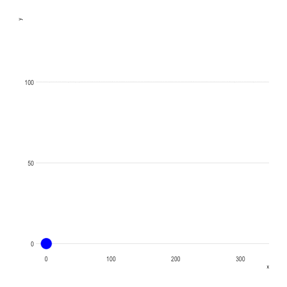

```{r setup, include=FALSE}
knitr::opts_chunk$set(echo = TRUE)
```

## R Markdown

Cette application permet de simuler la trajectoire d'un projectile connaissant les expression de x et de y en fonction du temps.

[Lien de l'application](https://aodiakite.shinyapps.io/simulation/_w_54454e50/)

{width="310"}

{width="315"}
